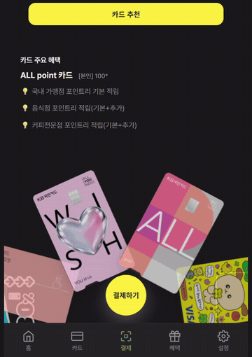

# 두리 (Duri) — 프론트엔드

카드 실적과 포인트, 멤버십을 한 곳에 모으고 결제 직전에 가장 유리한 카드를 골라주는 모바일 전자지갑입니다.

KB국민은행 주관 「[KB] IT's Your Life」 부트캠프 파이널 프로젝트(4인 팀, 2026.07.09 ~ 08.26)로 진행했고, **이 저장소는 그중 제가 전담한 프론트엔드 파트만 담고 있습니다.** 백엔드와 AI 서버는 팀원이 담당했으며 원 팀 저장소는 별도로 있습니다.




*부채꼴 배치에서 스와이프로 카드를 고르고, 위로 밀어 올리면 카드가 뒤집히며 결제로 이어집니다. 결제가 끝나면 카드는 원래 자리로 돌아옵니다. 테마는 `data-theme` 한 속성으로 화면 전체가 함께 바뀝니다.*

## 담당 범위

프론트엔드 전담(설계·구현 전체)과 UX·UI 설계, 서비스 기획, 팀장·PM을 맡았습니다. 이 저장소의 코드는 전부 제가 작성했습니다.

디자인 토큰을 정의하고, 그 토큰만으로 컴포넌트 61개를 만들고, 백엔드에서 제공한 API를 화면에 연결했습니다.

| 구분 | 규모 |
| --- | --- |
| 화면 | 22개 |
| 컴포넌트 | 61개 |
| 디자인 토큰 | 137개 (다크모드 31개 재정의) |
| 단위 테스트 | 5개 파일 28개 |

## 기술 스택

Vue 3 (`<script setup>`) · Vite · Vue Router · Pinia · Axios · Vitest · @vue/test-utils

UI 프레임워크는 쓰지 않았습니다. Tailwind, Bootstrap, Vuetify 없이 CSS를 직접 작성했고, 색·간격·타이포는 전부 `src/assets/styles/tokens.css`의 CSS 변수를 참조합니다.

## 실행

```bash
npm install
npm run dev        # 개발 서버
npm run build      # 프로덕션 빌드
npm test           # 단위 테스트 (Vitest)
npm run test:watch
```

백엔드 API 서버(`http://localhost:8080`)가 함께 떠 있어야 데이터가 채워집니다. 서버 없이도 화면 진입과 UI 동작은 확인할 수 있습니다.

## 구조

```
src/
├── api/          # 백엔드 도메인 1개당 파일 1개 (auth, wallet, member, chat …)
│   ├── axios.js      # 공용 인스턴스, 토큰 자동 첨부, 401 재발급 인터셉터
│   └── response.js   # 공통 응답 봉투를 푸는 유일한 지점
├── stores/       # Pinia setup 스타일
├── composables/  # useTheme, useToast, useTour
├── components/   # 도메인별 + common/ UI 프리미티브
├── views/        # 라우트 단위 화면
└── assets/styles/tokens.css   # 디자인 토큰
```

## 구현하면서 한 판단

| 상황 | 선택 | 이유 |
| --- | --- | --- |
| UI 프레임워크 | 사용하지 않음 | 토큰 기반 디자인 시스템을 직접 통제하려고 |
| 결제 카드 캐러셀 | 라이브러리 없이 직접 구현 | 제스처 분기와 2단계 추천 연출을 범용 캐러셀로 제어할 수 없어서 |
| 응답 처리 | `unwrapResponse` 한 곳으로 수렴 | 응답 구조가 바뀌어도 고칠 곳이 한 군데이도록 |
| 인증 체크 | 화면별 검사 대신 전역 라우터 가드 | 화면이 늘어도 규칙이 한 곳에만 있도록 |
| 카드 실적 조회 실패 | 기본 카드 목록은 유지 | 부가 정보 실패로 화면 전체가 비지 않도록 |
| 테스트 범위 | 5개 파일 28개 | 커버리지가 아니라 "틀리면 다른 곳까지 틀어지는 자리" 기준 |

각 판단의 배경과 코드는 [개발 포트폴리오 문서](docs/두리_개발자_포트폴리오.md)에 정리했습니다.

## 구현 범위와 제외 항목

- 발표 직전 추가된 일부 백엔드 API는 연동 범위에서 제외했습니다.
- API base URL은 현재 `src/api/axios.js`에 하드코딩돼 있습니다. 환경변수 분리는 미완입니다.
- 전 화면을 즉시 import하고 있어 라우트 단위 코드 분할은 적용하지 않았습니다.
- ESLint/Prettier 설정은 없습니다.

## 에셋 관련 고지

`public/images/`의 제휴사 로고는 저작권 문제로 **공개 저장소에서는 텍스트 플레이스홀더로 대체**했습니다. 파일명과 경로는 원본과 같아 코드 수정 없이 동작합니다. 실제 화면은 상단 GIF를 참고해주세요.

카드 도안 등 화면에 보이는 브랜드 자산은 부트캠프 학습용 프로젝트 범위에서만 사용했으며, 상업적 용도가 없습니다.

## 개발 환경 참고

저장소 루트의 `CLAUDE.md`는 AI 코딩 도구를 쓸 때 적용한 프로젝트 규약입니다. 응답 봉투 처리, 라우팅 컨벤션, 인증 규칙, 토큰 사용 원칙을 문서로 고정해두고 그 범위 안에서만 작업하도록 했습니다.
