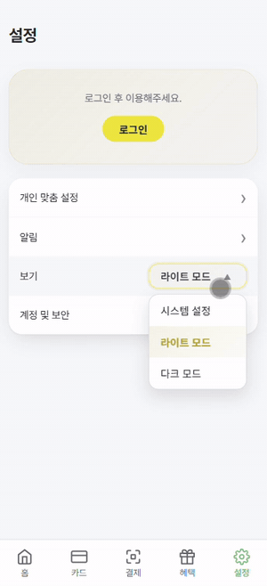
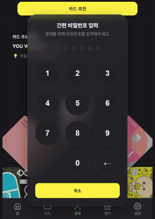

# 두리 — AI 기반 금융 혜택 통합 전자지갑

**프론트엔드 개발 포트폴리오**

> 카드 실적과 포인트, 멤버십을 한 곳에 모으고 결제 직전에 가장 유리한 카드를 골라주는 모바일 전자지갑입니다.
> 이 문서는 제가 직접 설계하고 구현한 프론트엔드 영역만 다룹니다.

---

## 1. 프로젝트 개요

| 항목 | 내용 |
| --- | --- |
| 기간 | 2026.07.09 ~ 2026.08.26 |
| 소속 | KB국민은행 주관 「[KB] IT's Your Life」 부트캠프 파이널 프로젝트 |
| 팀 구성 | 4명 (프론트엔드 1, 백엔드 3) |
| 담당 역할 | 팀장 / PM / 서비스 기획 / UX·UI 설계 / 프론트엔드 전담 |
| 기술 스택 | Vue 3 `<script setup>`, Vite, Vue Router, Pinia, Axios, Vitest, `@vue/test-utils` |
| 스타일링 | UI 프레임워크 미사용 (Tailwind·Bootstrap·Vuetify 없이 CSS 직접 작성) |
| 구현 규모 | 화면 22개 · 컴포넌트 61개 · 디자인 토큰 137개 · 단위 테스트 28개 |
| 저장소 | **← GitHub 링크 채우기** |

디자인 토큰을 정의하고, 그 토큰만으로 컴포넌트 61개를 만들고, 백엔드 팀원 3명이 만든 API를 화면에 붙였습니다. 디자인과 서버 사이 구간을 혼자 맡았습니다.

---

## 2. 구조

```
src/
├── api/          # 백엔드 도메인 1개당 파일 1개 (auth, wallet, member, chat …)
│   ├── axios.js      # 공용 인스턴스, 토큰 자동 첨부, 401 재발급 인터셉터
│   └── response.js   # 공통 응답 봉투를 푸는 유일한 지점
├── stores/       # Pinia setup 스타일 (card, auth, payment, personalization)
├── composables/  # useTheme, useToast, useTour
├── components/   # 도메인별 61개 + common/ UI 프리미티브
├── views/        # 라우트 단위 화면 22개
└── assets/styles/tokens.css   # 디자인 토큰 137개 (다크모드 31개 재정의)
```

코드를 쓰면서 지킨 규칙은 세 가지입니다.

- 색, 간격, 타이포 값은 `tokens.css`에만 두고 컴포넌트에서는 `var(--...)`로만 참조합니다.
- 서버 응답을 푸는 곳과 오류 문구를 고르는 곳은 각각 함수 하나로 제한합니다.
- 테스트는 커버리지를 채우기보다 한 번 틀리면 여러 화면이 같이 틀어지는 코드에 먼저 붙입니다.

---

## 3. 디자인 토큰과 테마

### 문제

Figma에만 색을 정의해두면 구현할 때 "이 회색이 아까 그 회색인지"를 매번 눈으로 확인하게 됩니다. 다른 팀 화면에서 간격이 들쭉날쭉하고 여백이 부족했던 것도 같은 이유로 보였습니다.

### 선택

색을 정하는 일과 색을 쓰는 일을 분리했습니다. 디자인 결정은 `tokens.css` 한 파일에서 끝내고, 컴포넌트에서는 색상 값을 직접 쓰지 않기로 규칙을 정했습니다.

### 구현

| 토큰 그룹 | 개수 |
| --- | --- |
| Color | 51 |
| Typography | 48 |
| Font weight/size | 11 |
| Spacing | 7 |
| Radius | 6 |
| Z-index | 6 |
| Shadow | 5 |
| Transition | 3 |
| :root 합계 | 137 |
| 다크모드 재정의 | 31 |

다크모드는 재정의가 필요한 31개만 `[data-theme="dark"]`에서 덮어씁니다. 나머지 106개는 두 모드가 공유하기 때문에 간격이나 타이포를 고칠 때 한 곳만 고치면 됩니다.

```css
/* :root — 라이트 */
--color-primary: #EFDD39;
--color-membership-icon: #3D6B52;
--color-coral: #A84E68;

/* [data-theme="dark"] — 필요한 값만 재정의 */
--color-primary: #FFEB3B;   /* 어두운 배경에서는 톤다운이 필요 없다 */
--color-btn-primary-text: #24242A;  /* 골드 배경 위 흰 글씨는 대비가 약해 진한 텍스트로 */
```

토큰 파일에는 값과 함께 그 값이 된 이유를 적어뒀습니다.

```css
/* Primary — 팀 결정으로 그린↔골드 반전 (2026-08-04).
   기존 --color-gold-* 토큰명은 그대로 두되 값만 그린으로 교체함
   (이름 리네이밍은 전체 코드베이스 참조가 많아 범위 밖으로 판단) */
```

브랜드 컬러를 뒤집기로 했을 때 토큰 이름까지 바꾸는 리팩터링은 하지 않았습니다. `--color-gold-*`를 참조하는 코드가 많아서, 마감까지 남은 기간을 생각하면 회귀 위험이 더 크다고 판단했습니다. 대신 이름을 그대로 둔 이유를 주석에 남겼습니다.

### 테마 전환

사용자가 고르는 값은 `system`, `light`, `dark` 세 가지인데 화면에 실제로 적용되는 값은 `light`, `dark` 두 가지입니다. 이 둘을 같은 값으로 다루면 버그가 납니다.

설정 화면을 토글이 아니라 세 항목을 고르는 목록으로 둔 것도 같은 이유입니다. 토글은 상태가 두 개뿐이라 '시스템 설정을 따라간다'는 선택지를 담을 수 없습니다.



*시스템 설정 · 라이트 모드 · 다크 모드 중에서 고르면 배경, 카드, 하단 네비게이션까지 한 번에 바뀝니다. 화면마다 색을 따로 정의하지 않고 `data-theme` 한 속성만 바꾸기 때문입니다.*

```js
// 고른 값을 실제 적용값으로 환산한다.
export const resolveTheme = (setting) => {
  if (setting !== 'system') return setting;
  return window.matchMedia('(prefers-color-scheme: dark)').matches ? 'dark' : 'light';
};

// 저장은 고른 값 그대로. 'system'을 'light'로 바꿔 저장하면
// OS를 다크로 바꿔도 따라가지 못하고, 설정 화면 라벨까지 틀어진다.
export const saveTheme = (setting) => {
  localStorage.setItem('theme', setting);
  applyTheme(setting);   // 적용은 환산된 값으로
};
```

### 다크모드는 색을 뒤집는 일이 아니었습니다

값을 반대로 넣는 것만으로는 같은 화면이 되지 않아서, 네 가지를 함께 조정했습니다.

| 항목 | 조정 |
| --- | --- |
| 대비 유지 | 두 모드 모두 WCAG AA 이상 확보 |
| 텍스트 명도 반전 | 라이트는 어두운 글자, 다크는 밝은 글자 |
| Accent 밝기 | Primary `#EFDD39` → `#FFEB3B` (어두운 배경에서는 톤다운이 불필요) |
| 섀도우 강화 | 어두운 배경에서 깊이와 계층이 뭉개지지 않도록 |

섀도우가 특히 그렇습니다. 라이트에서 쓰던 그림자를 그대로 두면 다크에서는 배경에 묻혀 카드가 평면으로 보입니다.

적용 우선순위는 세 단계로 고정했습니다.

```
1순위  data-theme        사용자가 명시적으로 고른 값
2순위  prefers-color-scheme   OS 설정 ('시스템 설정'을 골랐을 때)
3순위  :root              기본 라이트
```

사용자의 선택이 항상 OS 설정보다 앞섭니다. 다크 모드를 쓰는 사람이 이 앱만 라이트로 보고 싶을 수 있기 때문입니다.

### 결과

- 화면 22개가 라이트와 다크 양쪽에서 같은 시각 규칙을 따릅니다.
- 강사와 멘토로부터 "AI가 만든 티가 나지 않는다"는 평가를 받았습니다. 다른 팀에 비해 여백과 정렬이 일정하다는 이유였습니다.
- UX/UI 설명서와 발표 자료에도 앱의 실제 토큰 값만 썼습니다. 문서와 제품이 따로 놀지 않게 하려는 의도였습니다.

---

## 4. 결제 카드 캐러셀


*부채꼴 배치 → 좌우 스와이프로 카드 전환 → 위로 밀어 올리면 카드가 뒤집히며 비밀번호 모달이 올라옵니다.*

### 문제

결제 화면의 핵심 동작을 "카드를 부채꼴로 펼쳐 고르고, 위로 밀어 올려 결제한다"로 기획했습니다. 라이브러리로 풀리지 않는 요구가 세 가지 있었습니다.

1. 카드 개수에 따라 부채꼴 각도와 간격이 달라져야 함 (1장 / 2장 / 3장 이상)
2. 위로 밀기(플립)와 좌우 밀기(회전)를 한 제스처 스트림 안에서 구분해야 함
3. 추천 결과가 오면 모든 카드가 중앙으로 합쳐졌다가 추천순으로 다시 펼쳐지는 2단계 연출

### 선택

범용 캐러셀 라이브러리로는 2번과 3번을 제어할 수 없다고 판단해 터치 이벤트와 `requestAnimationFrame`으로 직접 구현했습니다. 대신 흩어지기 쉬운 매직 넘버는 전부 상수 객체 하나로 모아 조정할 수 있게 만들었습니다.

### 구현

**(1) 튜닝 값 모으기.** 임계값, 타이밍, 각도, 간격 27개를 `CAROUSEL_CONFIG`로 분리했습니다. 감각적인 조정을 로직 수정 없이 숫자만 바꿔서 할 수 있습니다.

```js
const CAROUSEL_CONFIG = {
  FLIP_THRESHOLD: 100,          // 이 이상 밀어야 플립으로 인정
  FLIP_COMPLETE_THRESHOLD: 0.5, // 절반 넘기면 자동 완성, 미만이면 원위치
  CARD_ANGLE_DEPTH_1: 45,       // 중앙 바로 옆 카드 각도
  CARD_ANGLE_DEPTH_2: 90,       // 그 바깥 카드 각도
  SWIPE_SMOOTHING_FACTOR: 0.3,  // 손가락 떨림 보정
  // …
};
```

**(2) 제스처 구분.** 세로 이동은 플립, 가로 이동은 회전으로 분기했습니다. 손가락 입력이 불규칙해서 값을 그대로 쓰면 카드가 떨리기 때문에, 현재값 30%에 직전값 70%를 섞어 보정했습니다.

```js
const deltaX = rawDeltaX * 0.3 + prevDeltaX * 0.7;
const deltaY = rawDeltaY * 0.3 + prevDeltaY * 0.7;
```

**(3) 되돌아가는 길을 하나로.** 결제가 성공하든 취소되든 타임아웃이 나든 카드는 원래 자리로 돌아와야 합니다. 분기마다 역방향 애니메이션을 만들면 경우의 수가 늘어날수록 빠지는 조합이 생깁니다. 그래서 상태를 초기화하는 함수 하나를 모든 종료 경로가 호출하게 하고, 복귀 동작은 CSS transition에 맡겼습니다.

```js
const resetInteractionState = () => {
  flipState.value = { progress: 0, index: null, offset: 0, isActive: false };
  cardUpOffset.value = 0;
  isDragging = false;
  swipeDirection = null;
};
// 성공, 닫기, 취소, 타임아웃 네 경로 모두 이 함수 하나를 부른다
```



*비밀번호 입력 → QR 인증(60초 카운트다운) → 결제 성공. 모달이 닫히면 카드가 부채꼴 위치로 스스로 돌아옵니다.*

**(4) 추천 애니메이션.** `easeInOutCubic` 이징을 직접 구현하고 `requestAnimationFrame`으로 800ms 동안 카드를 중앙으로 모읍니다. 그 뒤 추천 순서로 재정렬해서 1순위를 가운데 두고 다시 펼칩니다.

**(5) 카드 도안 방향 자동 판정.** 카드 도안은 가로형과 세로형이 섞여 들어옵니다. 카드마다 방향을 코드에 적어두면 카드가 추가될 때마다 코드를 고쳐야 하므로, 로드된 이미지의 실제 크기로 판정하게 했습니다.

```js
const markCardOrientation = (event) => {
  const img = event.target;
  img.classList.toggle('is-landscape', img.naturalWidth > img.naturalHeight);
};
```

### 결과

- 카드가 1장, 2장, 3장 이상일 때 모두 레이아웃이 유지되고 라이트와 다크 양쪽에서 동작합니다.
- 이 화면을 만들면서 프론트엔드를 계속하고 싶다고 생각하게 됐습니다. 기획으로 그린 화면이 실제로 손끝에 반응하는 걸 처음 봤습니다.

---

## 5. API 레이어와 오류 처리

백엔드는 모든 응답을 같은 봉투로 감싸 내려줍니다.

```
성공: { success: true,  code: "SUCCESS", data: {...}, message: null }
실패: { success: false, code: "CARD_NOT_FOUND", message: "...", errors: [] }
```

각 화면이 알아서 `response.data.data`를 꺼내 쓰면 응답 구조가 바뀔 때 화면 수만큼 고쳐야 합니다.

### 봉투를 푸는 지점을 하나로

```js
export const unwrapResponse = (response, fallbackMessage) => {
  const body = response.data;
  if (body?.success === false) {
    const error = new Error(body.message || fallbackMessage);
    error.code = body.code;   // 화면은 문구가 아니라 code로 분기하므로 반드시 남긴다
    throw error;
  }
  return body?.data ?? body;
};
```

오류 문구를 고르는 규칙도 한곳으로 모았습니다. 서버가 이유를 알려줬으면 그것을 쓰고, 연결 자체가 끊겼으면 예외 메시지를, 둘 다 없으면 화면이 정한 기본 문구를 씁니다.

```js
export const getErrorMessage = (error, fallback) =>
  error?.response?.data?.message || error?.message || fallback;
```

### 토큰이 만료돼도 요청을 잃지 않게

401이 뜨면 토큰을 재발급받고 원래 요청을 재시도합니다. 이때 여러 요청이 동시에 401을 맞으면 재발급이 중복 호출됩니다. 재발급이 진행 중인 동안 들어온 요청은 큐에 넣었다가 새 토큰으로 한 번에 재실행하도록 했습니다.

```js
let isRefreshing = false;
let refreshQueue = [];

if (isRefreshing) {
  return new Promise((resolve) => {
    addRefreshQueue((newAccessToken) => {
      originalRequest.headers.Authorization = `Bearer ${newAccessToken}`;
      resolve(api(originalRequest));   // 새 토큰으로 원래 요청을 다시 보낸다
    });
  });
}
```

재발급까지 실패하면 로그아웃하고 로그인 화면으로 보냅니다. 여기서 작은 결정을 하나 했습니다.

```js
// alert()는 이동 전에 사용자가 메시지를 읽도록 강제로 막아줬다.
// 토스트는 non-blocking이라 곧장 이동하면 뜨자마자 화면이 바뀌어 못 본다 —
// 리다이렉트를 살짝 늦춰 토스트를 읽을 시간을 준다.
setTimeout(() => { window.location.href = '/auth/login'; }, 1500);
```

### 일부가 실패해도 화면은 살리기

카드 목록 화면은 기본 목록 API와 월별 실적 API 두 개를 합쳐 그립니다. 실적 조회가 실패했다고 카드 목록까지 빈 화면이 되면 안 된다고 봤습니다.

```js
// (요지 발췌)
const basicCards = (await getUserCards())?.userCards.map(toBasicCardViewModel);
cards.value = basicCards;                     // 먼저 기본 목록을 채우고

try {
  const statusResponse = await getCardMonthlyStatuses(params);
  cards.value = basicCards.map(mergeStatus);  // 실적이 오면 덮어쓴다
} catch (statusError) {
  // 실적 조회가 실패해도 기본 보유카드 목록은 화면에 유지한다
  console.error('카드 실적 조회 실패', statusError);
}
```

### 인증은 화면이 아니라 라우터에서

처음에는 각 화면에서 개별로 로그인 여부를 확인했습니다. 화면이 늘면서 확인이 빠진 화면이 생겼고, 로그인하지 않아도 URL만 알면 들어갈 수 있는 상태가 됐습니다. 라우트에 `meta.requiresAuth`를 선언하고 전역 가드 한 곳에서 판단하도록 바꿨습니다.

```js
router.beforeEach((to) => {
  if (to.meta.requiresAuth && !useAuthStore().isLogin()) {
    return '/auth/login';
  }
});
```

- 보호 라우트 17개 (홈, 카드, 결제, 거래내역, 혜택, 설정 전체)
- 공개 라우트 5개 (약관, 회원가입, 로그인, 비밀번호 변경, 온보딩)
- 없는 경로는 `/:pathMatch(.*)*` 캐치올로 `/home`에 보내 404 화면 대신 정상 진입점으로 복귀시킵니다.

새 화면을 추가할 때 할 일은 라우트 한 줄에 `meta: { requiresAuth: true }`를 붙이는 것뿐입니다.

### 타이머 회수

QR 결제 인증 화면은 60초 카운트다운과 별도 타임아웃을 함께 돌립니다. 모달은 사용자가 언제든 닫을 수 있으므로 `onUnmounted`에서 `clearInterval`과 `clearTimeout`을 모두 정리해, 화면이 사라진 뒤에 이벤트가 발생하지 않게 했습니다. 시간이 만료되면 실패로 끝내지 않고 재발급 모달로 이어집니다.

### 브라우저 저장 한도 계산

프로필 사진은 서버 저장소가 없어서 base64로 `localStorage`에 들어갑니다. 폰 사진 3MB는 base64로 4MB가 되어 브라우저 한도(대개 5MB)에 걸리고, 그러면 저장이 통째로 실패합니다. 아바타가 실제로 그려지는 크기(100px, 고해상도를 감안해 256px)로 리사이즈한 뒤 JPEG로 고정해 담습니다.

### 테스트를 고른 기준

Vitest와 jsdom 환경을 직접 구성하고 5개 파일 28개 테스트를 작성했습니다. 대상은 커버리지가 아니라 "여기가 틀리면 다른 곳까지 틀어지는 자리"로 골랐습니다.

| 대상 | 테스트 | 고른 이유 |
| --- | --- | --- |
| `unwrapResponse` | 4 | 모든 API 호출이 통과하는 유일한 지점 |
| `getErrorMessage` | 4 | 사용자가 보는 오류 문구를 결정 |
| `validatePassword`, `maskCardNumber` | 7 | 규칙이 명확해 회귀가 즉시 드러남 |
| `resolveTheme`, `saveTheme` | 6 | 실제로 한 번 틀렸던 곳 (회귀 테스트) |
| `PaymentPasswordModal` | 7 | 결제 관문. 서버 응답별 화면 반응 검증 |

테스트는 내부 상태를 건드리지 않고 사용자가 하는 동작 그대로 작성했습니다.

```js
// 내부 상태를 직접 건드리면 "버튼이 함수에 연결되지 않은" 종류의 버그를 놓친다.
const enterSixDigits = async (wrapper) => {
  const oneKey = wrapper.findAll('.keypad button')[0];
  for (let i = 0; i < 6; i += 1) await oneKey.trigger('click');
};

it('여러 번 틀려 잠기면 서버가 내려준 안내를 그대로 보여준다', async () => {
  // 잠금 사유는 서버만 알기 때문에 화면이 문구를 지어내면 안 된다.
  verifySimplePassword.mockRejectedValue({
    response: { status: 429, data: { message: '5분 후에 다시 시도해주세요.' } },
  });
  // …
  expect(wrapper.find('[role="alert"]').text()).toBe('5분 후에 다시 시도해주세요.');
});
```

`useTheme` 테스트는 실제로 났던 버그를 다시 잡기 위한 회귀 테스트입니다.

```js
// 예전 코드는 '시스템 설정'을 고르면 OS를 확인하지 않고 무조건 라이트로 적용했다.
// 개발 환경이 대부분 라이트 모드였던 탓에 결과가 우연히 맞아떨어져 아무도 발견하지 못했다.
it("'시스템 설정'은 OS가 다크면 dark로 환산한다", () => {
  mockOS(true);
  expect(resolveTheme('system')).toBe('dark');
});
```

### 결과

- 응답 구조, 오류 문구, 인증 만료 처리가 각각 함수 하나로 수렴해서 도메인 API 모듈이 8개로 늘어나는 동안 이 규칙은 바뀌지 않았습니다.
- 네트워크 끊김, 토큰 만료, 일부 API 실패 상황에서도 화면이 빈 채로 멈추지 않습니다.

---

## 6. 접근성

색을 정하는 사람과 구현하는 사람이 같았기 때문에, 대비가 부족한 조합을 토큰 단계에서 잡을 수 있었습니다. 눈으로 판단하지 않고 값을 계산해서 확인했습니다.

### 명암비 실측

본문 4.5:1, UI 요소 3:1을 기준으로 각 요소의 실제 배경 토큰과 짝지어 측정했습니다.

| 조합 | 전경 | 배경 | 대비 | 판정 |
| --- | --- | --- | --- | --- |
| 본문 (라이트) | `#24242A` | `#F7F8FA` | 14.5:1 | AAA |
| 본문 (다크) | `#EDEFF1` | `#1A1A1C` | 15.1:1 | AAA |
| 보조 (라이트) | `#63666B` | `#F7F8FA` | 5.4:1 | AA |
| 보조 (다크) | `#8A8D93` | `#1A1A1C` | 5.2:1 | AA |
| 버튼 텍스트 | `#24242A` | `#EFDD39` | 11.1:1 | AAA |
| Coral 텍스트 | `#A84E68` | `#FFFFFF` | 5.3:1 | AA |
| Tertiary (라이트) | `#83868B` | `#FFFFFF` | 3.7:1 | 본문 기준 미달 |
| 하단 탭 활성 | `#7AB88A` | `#FFFFFF` | 2.3:1 | 미달 |

이 표는 브랜드 컬러를 그린에서 골드로 뒤집은 뒤 다시 잰 결과입니다. 바탕이 밝아지면서 **골드 위의 흰 글씨가 1.39:1**까지 떨어졌는데, 눈으로는 괜찮아 보였고 재보고 나서야 기준의 3분의 1이라는 걸 알았습니다. 버튼 텍스트를 `#24242A`로 바꿔 11.08:1을 확보하고, 같은 기준으로 나머지 색도 전부 다시 측정했습니다.

색을 하나 바꾸면 그 위에 얹힌 것을 모두 다시 재야 한다는 걸 이때 알았습니다.

### 색에만 의존하지 않는 신호

색맹·저시력 사용자에게 색은 전달되지 않을 수 있어서, 의미를 담은 상태는 색과 함께 다른 단서를 붙였습니다.

| 상태 | 색 외의 신호 |
| --- | --- |
| 입력 오류 | 테두리 + 안내 문구 + `aria-invalid` |
| 키보드 포커스 | 테두리 + 3px 포커스 링 (`--color-focus-ring`) |
| 적립 성공 | 색 + '적립 완료' 라벨 |
| 추천 1위 | 색 + 순위 숫자 병기 |
| 토스트 | `role="alert"` + `aria-live` |
| 모달 | `role="dialog"` + `aria-modal` |
| 아이콘 버튼 | `aria-label` |

토스트는 `aria-live` 값을 종류에 따라 나눴습니다.

```html
role="alert"
:aria-live="type === 'error' ? 'assertive' : 'polite'"
aria-label="알림 닫기"
```

오류는 읽고 있던 내용을 끊고서라도 알려야 하고, 일반 알림은 끊지 않아야 합니다. 둘 다 `assertive`로 두면 화면 낭독기를 쓰는 사용자에게 사소한 알림이 계속 끼어듭니다.

입력 필드는 오류 문구를 입력칸에 연결해서, 낭독기가 "이 칸에 무슨 문제가 있는지"까지 함께 읽도록 했습니다.

```html
:aria-invalid="error ? 'true' : undefined"
:aria-describedby="message ? messageId : undefined"
:role="error ? 'alert' : undefined"
```

### 터치 영역

iOS HIG와 Material이 공통으로 제시하는 최소 44×44px를 기준으로 점검했습니다.

| 요소 | 크기 | 판정 |
| --- | --- | --- |
| 기본 버튼 (large) | 100% × 52 | 충족 |
| 입력 필드 | 100% × 48 | 충족 |
| 하단 탭 1칸 | 96 × 70 | 충족 |
| 토스트 닫기 | 24 → 44 | 확장 완료 |
| 작은 버튼 (small) | auto × 36 | 미달 |
| 모달 닫기 X | 28 × 28 | 미달 |

토스트 닫기 아이콘은 시각적으로는 24px를 유지하면서 히트박스만 넓혔습니다. 아이콘을 키우면 레이아웃이 흔들리기 때문입니다.

```css
/* 아이콘은 24×24 지만 ::after 로 히트박스를 44×44 까지 넓힌다 (터치 영역 최소치) */
.toast-close::after { ... }
```

### 아직 못 고친 것

전수 점검을 했지만 마감까지 다 고치지는 못했습니다. 고친 것과 남은 것을 구분해서 기록해뒀습니다.

- Tertiary 텍스트 3.7:1, 하단 탭 활성 2.3:1은 본문 기준에 못 미칩니다. 브랜드 컬러와 얽혀 있어 토큰을 다시 조정해야 하는 범위였습니다.
- small 버튼(36px)과 모달 닫기(28px)는 44px에 미달합니다. 토스트 닫기에 쓴 `::after` 히트박스 방식을 그대로 적용하면 됩니다.

측정해서 목록을 만들어두면 다음에 손댈 때 다시 재지 않아도 됩니다.

---

## 7. 트러블슈팅

프론트엔드에서 정리한 이슈 5건입니다. 대부분은 기능을 만들다 막힌 게 아니라, 만들어 둔 것을 다시 점검하다 나왔습니다.

### 1. '시스템 설정'을 골라도 항상 라이트로 적용됨

**발견 경위.** UX/UI 설명서를 다 쓴 뒤, 문서에 적은 내용이 실제 코드와 맞는지 전수 대조하던 중에 나왔습니다. 문서에는 테마 선택지가 세 개라고 적어놨는데 코드는 OS를 확인하지 않고 있었습니다.

**원인.** `system`을 환산하지 않고 그대로 라이트로 처리하고 있었습니다. 팀원 전원의 OS가 라이트 모드여서 개발 내내 결과가 우연히 맞아떨어졌고, 그래서 아무도 이상하다고 느끼지 못했습니다.

**해결.** `matchMedia`로 OS 값을 읽어 환산하고, 같은 실수가 다시 들어오지 않도록 회귀 테스트 6개를 붙였습니다.

개발 환경이 한쪽으로 쏠려 있으면 버그가 정답처럼 보인다는 걸 여기서 배웠습니다. 그 뒤로는 테마 관련 작업을 할 때 OS 설정을 바꿔가며 확인합니다.

### 2. 라우터에는 있는데 들어갈 수 없는 화면 10개

**원인.** 여러 페이지를 바텀시트로 전환하면서 옛 화면 파일을 지우지 않았습니다.

**해결.** 파일 이름으로 판단하지 않고 **import 기준으로 대조**했습니다. 이름이 비슷한 화면이 여러 개라 이름으로 지웠다가는 살아 있는 화면을 지울 수 있었습니다. 실제로 어디서도 import되지 않는 파일만 추려 10개를 삭제했습니다.

### 3. 로그인하지 않아도 URL만 알면 들어가지는 화면

**원인.** 공통 가드 없이 화면마다 개별로 로그인 여부를 확인하고 있었고, 그러다 보니 확인이 빠진 화면이 생겼습니다.

**해결.** 라우트에 `meta.requiresAuth`를 선언하고 전역 가드 한 곳에서 판단하도록 통합했습니다. 구현은 5장에 정리했습니다.

### 4. 같은 추천 기능인데 화면마다 반환 형태가 다름

**원인.** 화면을 만들 때마다 필요한 API 호출 함수를 각자 추가해서, 같은 엔드포인트를 부르는 함수가 여러 개 생겼습니다. 화면마다 응답을 다르게 가공하고 있었습니다.

**해결.** 공용 함수 하나로 통합했습니다. 지금 `unwrapResponse`를 유일한 통로로 두는 규칙은 이 일을 겪고 정한 것입니다.

### 5. 결제 금액을 비우면 QR 생성이 실패

**원인.** 기획을 "금액은 선택 입력"으로 바꿨는데 DB 컬럼은 필수값으로 남아 있었습니다. 화면과 스키마가 어긋난 상태였습니다.

**해결.** 백엔드와 함께 서버 검증을 완화하고, 저장 전에 `null`을 0으로 변환하도록 했습니다. 기획 변경이 화면에서 끝나지 않고 스키마까지 내려간다는 걸 이때 확인했습니다.

### 막히는 지점을 먼저 그리기

이슈를 겪고 나서는 화면을 그릴 때 정상 흐름보다 막히는 상황을 먼저 정리했습니다.

| 상황 | 내린 판단 |
| --- | --- |
| 비어 있을 때 | 카드는 등록했는데 혜택 데이터가 없음 → 화면 전체를 비우지 않고 컴포넌트마다 따로 분기 |
| 틀릴 수 있을 때 | 결제 금액을 모르는 채로 결제하려 함 → 금액을 선택 입력으로 |
| 너무 많을 때 | 고정 카드를 계속 늘리면 홈이 무의미해짐 → 3개 제한 + 초과 시 토스트로 이유 안내 |
| 처음일 때 | 스와이프가 되는지 아무도 모름 → 최초 1회만 안내 토스트 |

---

## 8. 팀 리드로서 한 판단

### 설계 산출물 검토

스키마를 직접 작성하지는 않았습니다. 대신 설계 산출물 네 가지가 전부 제 검토를 거쳤습니다.

| 산출물 | 관여 |
| --- | --- |
| ERD | 중간·최종 검토, 일부 직접 수정 |
| API 명세 | 중간·최종 검토, 일부 직접 수정 |
| 엔티티 보고서 | 중간·최종 검토 |
| 테이블 정의서 | 중간·최종 검토 |

한 번에 몰아서 보지 않고 중간 단계에서 한 번, 최종본에서 한 번 봤습니다. PK/FK 정합성이 맞지 않는 부분은 수정을 요청하거나 직접 고쳤습니다.

프론트엔드에서 데이터를 붙이다 보면 설계의 빈틈이 가장 먼저 드러납니다. 명세와 실제 응답이 다르거나, 화면에 필요한 값이 어느 테이블에도 없는 상황을 먼저 만나는 쪽이 프론트라서, 이 검토는 팀장 일이면서 동시에 제 구현을 위한 일이었습니다. 7장 5번 이슈(기획은 선택 입력으로 바뀌었는데 DB 컬럼은 필수값)가 그렇게 걸러지지 못하고 넘어간 사례입니다.

### 협업 규약 문서화

팀 전체가 같은 규칙 위에서 움직이도록 프로젝트 규약을 저장소 문서로 남겼습니다.

| 규약 | 내용 |
| --- | --- |
| 응답 봉투 | `code`로 분기한다 (`message` 문자열로 분기 금지) |
| 인증 | 모든 요청 `Bearer JWT`, 회원 ID는 토큰에서 서버가 추출 (요청 본문에 담지 않음) |
| 필드 | API JSON은 camelCase (DB snake_case를 백엔드에서 변환) |
| 금액 | 원 단위 정수, 소수점 없음 |
| 소유권 | 타인 리소스 요청은 `403`이 아닌 `404 NOT_FOUND` |
| 라우트 | 정적 경로를 동적 `:id` 경로보다 먼저 선언 (`/cards/register` 다음에 `/cards/:id`) |

### 브랜치와 리뷰 규칙

4명이 세 개 서버(프론트·백엔드·AI)를 나눠 만들었기 때문에, 코드가 섞이는 지점을 규칙으로 먼저 막았습니다.

| 항목 | 규칙 |
| --- | --- |
| 브랜치 | `main` 직접 push 금지, `develop`에서만 merge, 작업은 `feature/기능명`·`fix/버그명` |
| 머지 조건 | 승인 1명 + CI 통과, squash merge |
| PR 템플릿 | 무엇을 · 왜 · 변경 사항 · **다른 파트 영향** · 리뷰어가 볼 곳 |
| 커밋 | `feat` · `fix` · `docs` · `chore` · `refactor` · `perf` |
| CI | 세 파트 병렬 검사 (프론트는 빌드, 백엔드는 실제 MySQL 8, 챗봇은 DB 연결 상태로 pytest) |

PR 템플릿에 "다른 파트 영향" 칸을 넣은 게 실제로 도움이 됐습니다. 서버가 세 개로 나뉘어 있어서 한쪽 변경이 다른 쪽 연동을 깨는 일이 잦았는데, 이 칸을 채우면서 미리 걸러졌습니다.

### 기능 표기 규칙

추천 결과 화면의 문구를 "AI 추천"이 아니라 "추천 결과", "추천 근거"로 표기하도록 정했습니다. 숫자를 계산하는 것은 추천 엔진이고 LLM은 그 결과를 문장으로 바꾸는 역할만 합니다. "AI가 추천했다"고 쓰면 사용자가 실제보다 과장된 기대를 하게 되고, 금융 서비스에서는 그 오차가 그대로 신뢰 문제가 된다고 봤습니다.

### 통합 전 리스크 확인

- 팀원이 구현한 자연어 질의 기능이 질문과 맞지 않는 답을 반환하는 것을 확인하고, 시연 전에 강사에게 별도로 문제를 제기했습니다.
- 기획 단계에서 "타인의 카드 사용을 유도하는 기능"이 여신전문금융업법에 저촉된다는 점을 확인하고 방향을 정보 공유형으로 조정했습니다.
- 기획 검증을 위해 「카드 혜택 관리 경험 조사」 설문을 직접 진행했습니다 (N=34, 2026.08.11~08.15).

---

## 9. 기술 선택 정리

| 상황 | 선택 | 이유 |
| --- | --- | --- |
| UI 프레임워크 | 사용하지 않음 | 토큰 기반 디자인 시스템을 직접 통제하려고 |
| 결제 카드 캐러셀 | 라이브러리 없이 직접 구현 | 제스처 분기와 2단계 추천 연출을 범용 캐러셀로 제어할 수 없어서 |
| 브랜드 컬러 반전 | 값만 교체, 토큰명 유지 | 전면 리네이밍은 남은 기간 대비 회귀 위험이 크다고 판단 |
| 카드 도안 방향 | 이미지 실제 크기로 판정 | 카드가 추가돼도 코드를 고칠 필요가 없게 |
| 애니메이션 복귀 | 상태 초기화 함수 1개 + CSS transition | 종료 경로가 늘어도 빠지는 분기가 안 생기게 |
| 테스트 범위 | 5개 파일 28개 | 커버리지가 아니라 "틀리면 다른 곳까지 틀어지는 자리" 기준 |
| 인증 체크 위치 | 화면별 검사 대신 전역 라우터 가드 | 화면이 늘어도 규칙이 한 곳에만 있도록 |
| 명암비 | 토큰 확정 단계에서 실측 | 구현을 마친 뒤 발견하면 팔레트를 다시 뒤집어야 해서 |
| 프로필 이미지 | 256px 리사이즈 후 JPEG 고정 | `localStorage` 한도 초과로 저장이 통째로 실패하는 것을 방지 |

---

## 10. 회고

비전공자로 부트캠프를 시작해서, 이 프로젝트에서 처음으로 설계한 대로 움직이는 화면을 만들었습니다.

가장 많이 배운 건 코드를 잘 쓰는 법보다 결정을 남기는 법이었습니다. 토큰 이름을 그대로 둔 이유, 리다이렉트를 1.5초 늦춘 이유, 실적 API 실패를 삼키기로 한 이유는 코드만 봐서는 알 수 없습니다. 남겨두지 않으면 다음 사람이 되돌립니다. 그래서 이 프로젝트 코드에는 무엇을 하는지보다 왜 그렇게 했는지가 더 많이 적혀 있습니다.

남은 과제는 손댈 순서대로 정리해뒀습니다.

| 항목 | 현재 | 다음 단계 |
| --- | --- | --- |
| API base URL | `localhost:8080` 하드코딩 | 환경변수 기반 설정으로 분리 |
| 라우팅 | 인증 가드는 적용, 전 화면 즉시 import | 라우트 단위 lazy loading으로 초기 로딩 분할 |
| 스토어 네이밍 | `cardStore.js`와 `payment.js` 혼재 | 규칙 통일 |
| 린트 | 설정 없음 | ESLint + Prettier 도입 |
| 테스트 | 핵심 5개 파일 | 결제 플로우 통합 테스트로 확장 |
| 접근성 | 미달 항목 4건 파악 완료 | Tertiary·하단 탭 대비 조정, 터치 영역 44px 확장 |
